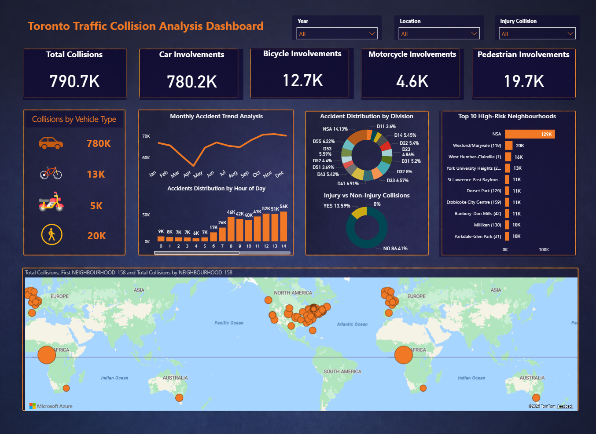

# Toronto Traffic Collision Analysis

## Project Overview
This project analyses traffic collision data from Toronto to identify accident patterns and predict collision severity using Python, Power BI, and machine learning.

The main aim of this project is to understand traffic collision trends and support better decision-making for road safety.

## Tools and Technologies
- Python
- Jupyter Notebook
- Pandas
- NumPy
- Matplotlib
- Seaborn
- Scikit-learn
- XGBoost
- Power BI

## Key Features
- Cleaned and prepared traffic collision data
- Analysed accident trends by time, month, and severity
- Created visualisations to understand collision patterns
- Built machine learning models to predict fatal and non-fatal collisions
- Compared Decision Tree, Random Forest, and XGBoost models
- Evaluated models using precision, recall, F1-score, and ROC-AUC

## Machine Learning Models Used
- Decision Tree
- Random Forest
- XGBoost

## Dashboard Preview


## Files Included
- `traffic_collision_analysis.ipynb` - Python notebook for analysis and machine learning
- `Traffic_Collisions_Open_Data.csv` - Sample traffic collision dataset
- `dashboard-preview.png` - Dashboard screenshot
- `final-report.pdf` - Final project report
- `requirements.txt` - Python libraries required for the project

## How to Run
1. Download or clone this repository.
2. Install the required libraries:

```bash
pip install -r requirements.txt
